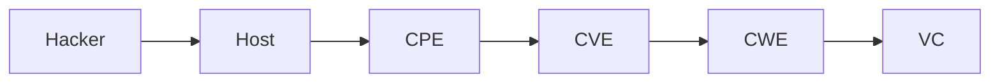

# PAGDrawer Refactoring Summary - 2026-01-09

## Overview
Major refactoring of the knowledge graph structure and visualization to support a per-host vulnerability model and cleaner data flow. The graph now represents unique instances of vulnerabilities per machine, eliminating "spaghetti" connections and logic loops.

## Key Changes

### 1. Per-Host Graph Model
- **Infrastructure**: Each Host is a unique anchor.
- **Components**: CVEs, CPEs, and VCs are now instantiated **per-host** (e.g., `CVE-2021-44228@host-001`).
- **Isolation**: Prevents false positive paths where a vulnerability on Host A could act as a prerequisite for Host B.

### 2. Linear Edge Flow
Restructured the graph to follow a strict left-to-right attack logic:

- **Removed**: Backward loops and `ALLOWS_EXPLOIT` edges that caused circular logic.
- **Added**: `LEADS_TO` edges from CWE to VC, clarifying that a weakness type results in a specific privilege state.

### 3. Per-CVE Weakness Nodes
- **Singular CWEs**: Instead of global shared CWE nodes (which caused massive edge crossing), each CVE now generates its own CWE node (e.g., `CWE-79@CVE-...`).
- **Result**: Drastically cleaner visualization with straight lines from CVE → CWE → VC.

### 4. Visualization Improvements
- **Column Layout**: New custom layout engine that organizes nodes into strict vertical columns by type (`ATTACKER`, `HOST`, `CPE`, `CVE`, `CWE`, `VC`).
- **Smart Positioning**: Nodes within columns are positioned based on their predecessors to minimize line crossings.
- **Exploit Path Filter**: Added **"🎯 Exploit Paths"** button to toggle visibility of only the nodes relevant to successful attack chains (paths leading to `EX:Y` states).
- **Styling**: Reverted to distinct colors for improved readability and consistent node shapes.

## Current Graph Stats
- **Nodes**: ~70 (increased due to per-host duplication)
- **Edges**: ~80 (simplified, direct connections)
- **Flow**: Strictly directional (Left -> Right)
