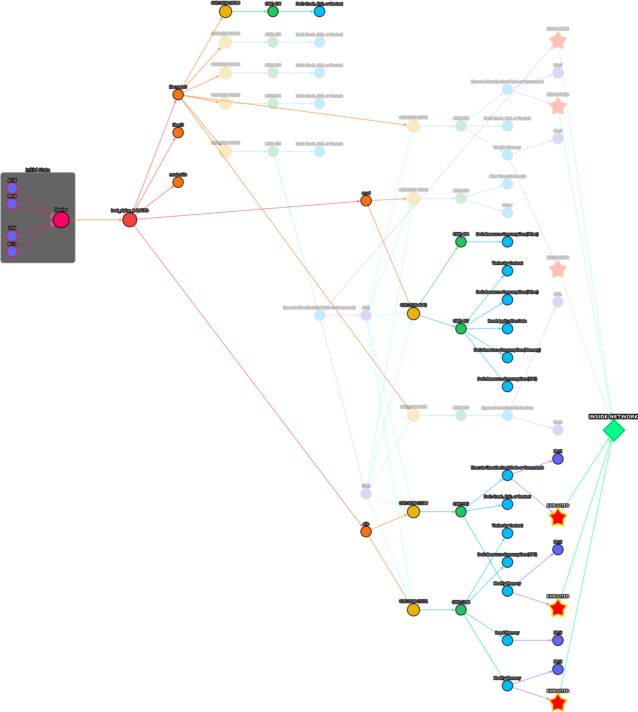

# PAGDrawer

**Privilege-based Attack Graph Drawer** — transform vulnerability scan data into interactive attack graphs.

PAGDrawer models how attackers exploit CVEs to escalate privileges and move laterally through networks, using the **Consensual Transformation Matrix** from [Machalewski et al. (2024)](Docs/EXPRESSING%20IMPACT%20OF%20VULNERABILITIES%20AN%20EXPERT-FILLED%20DATASET%20AND%20VECTOR%20CHANGER%20FRAMEWORK%20FOR%20MODELLING%20MULTISTAGE%20ATTACKS%2C%20BASED%20ON%20CVE%2C%20CVSS%20and%20CWE.pdf) to map technical impacts to privilege changes.

---

## Screenshots

Rich view of a real `alpine:edge` scan — all node types visible, full duplication across hosts and layers:



The same graph after progressive simplification (hide intermediate layers, merge similar CVEs, filter to exploit paths):


---

## Features

- **Typed graph**: 8 node types (Host / CPE / CVE / CWE / TI / VC / Bridge / Attacker) with distinct colors for pre-attentive reading
- **Chain-depth-aware multistage attacks** — BFS assigns attack-step depth to each CVE based on prerequisite satisfaction
- **Two-layer attack model** — external attack surface (L1) → `INSIDE_NETWORK` bridge → internal lateral movement (L2); L2 can be skipped for simpler analysis
- **Granularity sliders** — per-node-type control over duplication: one shared CVE node vs one per host vs one per CPE
- **Visibility toggles** with bridge edges — hide layers without losing connectivity
- **CVE merge modes** — group CVEs by shared CVSS prerequisites or shared VC outcomes
- **Environment filters (UI / AC)** — dim CVEs unreachable in the current operational environment
- **Exploit path filter** — highlight only paths leading to `EX:Y` terminal states
- **Graph drawing quality metrics** per [Purchase (2002)](https://doi.org/10.1006/jvlc.2002.0232) — edge crossings, drawing area, edge-length CV; CSV export for paper-grade snapshots
- **Persistent caches** — NVD / EPSS / CWE data cached in MongoDB with TTL and force-refresh
- **Background rebuild jobs** with progress bar and cancel support

---

## Quick start

```bash
# Prerequisite: Docker (for MongoDB)
bash Scripts/start-mongo.sh

# Backend (FastAPI on :8000)
bash Scripts/start-backend.sh

# Frontend (Vite dev server on :3000)
bash Scripts/start-frontend.sh
```

Open http://localhost:3000. Upload a Trivy scan (examples in `examples/`) and click Rebuild.

### Stop

```bash
bash Scripts/kill-backend.sh
bash Scripts/kill-frontend.sh
bash Scripts/kill-mongo.sh   # data persists in the pagdrawer_mongodb_data volume
```

### Run tests

```bash
# Backend (Python) — skip the Mongo startup check for isolated tests
PAGDRAWER_SKIP_MONGO=1 python -m pytest tests/ -v

# Frontend (TypeScript)
cd frontend && npm run test
```

---

## Tech stack

| Layer        | Technology                        | Port  |
|--------------|-----------------------------------|-------|
| Backend      | Python 3.10 + FastAPI + NetworkX  | 8000  |
| Frontend     | TypeScript + Vite + Cytoscape.js  | 3000  |
| Persistence  | MongoDB 7 (Docker)                | 27017 |
| Testing      | pytest + Playwright + Vitest      | —     |

---

## Documentation

- [`Docs/_projectStatus/`](Docs/_projectStatus/) — versioned project snapshots (`2026-04-20-15-55-Project_State_Overview.md` is the current one)
- [`Docs/_domains/`](Docs/_domains/) — domain docs on individual mechanisms (chain depth, CVE merge, MongoDB persistence, drawing quality metrics, readability mechanisms)
- [`Docs/_dailyNotes/`](Docs/_dailyNotes/) — development logs per feature
- [`Docs/Plans/`](Docs/Plans/) — planning documents for larger features

---

## Research foundation

> **Machalewski et al. (2024)** — *Expressing Impact of Vulnerabilities: An Expert-Filled Dataset and Vector Changer Framework for Modelling Multistage Attacks, Based on CVE, CVSS and CWE.*

Drawing-quality metrics:

> **Purchase, H.C. (2002)** — *Metrics for Graph Drawing Aesthetics.* Journal of Visual Languages and Computing, 13(5), 501–516.

---

## License

[Apache 2.0](LICENSE)
